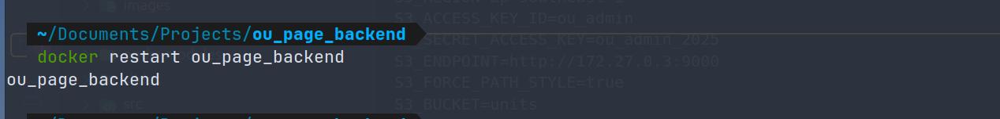

# 1. Requirement

- You need to install docker to run this application
  <a href="https://docs.docker.com/engine/install/">Install Docker</a>

# 2. Installation

## a. Install essential libraries

```Copy
npm install
```

## b. Add Environment Variables

- Create a new `.env` file at the same level as the `src` directory.

```Copy
TYPEORM_DATABASE_FILE=/var/private/database/ou_page_database.sqlite
TYPEORM_SYNCHRONIZE=true

S3_REGION=ap-southeast-1
S3_ACCESS_KEY_ID=ou_admin
S3_SECRET_ACCESS_KEY=ou_admin_2025
S3_ENDPOINT=http://172.27.0.3:9000
S3_FORCE_PATH_STYLE=true
S3_BUCKET=units
S3_MEDIA_ENDPOINT=http://localhost:9000/units

# Add this to request's header (POST and DELETE methods)
API_KEY=YXBpX2tleV9ndWFyZF9kYXk=
```

## c. Run docker compose file

```Copy
docker compose up -d
```

> **Bug:** S3Client can't connect to MinIO using its DNS in Docker Network. Use MinIO's IP Address instead.
>
> ### i. Find MinIO's IP Address
>
> ```Copy
> docker inspect -f '{{range.NetworkSettings.Networks}}{{.IPAddress}}{{end}}' ou_page_storage
> ```
>
> 
>
> ### ii. Change the IP address of S3_ENDPOINT to the IP you just found
>
> ```Copy
> S3_ENDPOINT=http://172.27.0.3:9000
> ```
>
> ### iii. Resart Backend
>
> ```Copy
> docker restart ou_page_backend
> ```
>
> 

## d. API documents

- <a href="http://localhost:3000/docs">http://localhost:3000/docs/</a>
  

## e. MinIO Console And Sqlite

- MinIO Console: <a href="http://localhost:9001">http://localhost:9001/</a>
  - **Username:** ou_admin
  - **Password:** ou_admin_2025
- SQLite: Connect using the `ou_page_database.sqlite` file located in the `database` folder.
